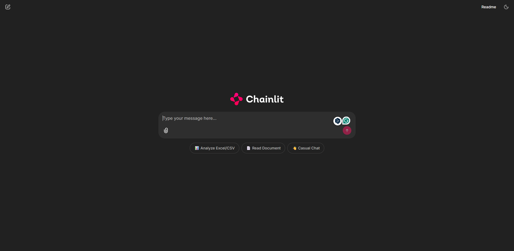

# 📊 Intelligent Data Assistant — Agentic RAG System

An enterprise-grade, **multi-agent Retrieval-Augmented Generation (RAG)** application built with [LangGraph](https://github.com/langchain-ai/langgraph), [LangChain](https://github.com/langchain-ai/langchain), and [Chainlit](https://github.com/Chainlit/chainlit). Upload documents and datasets, ask questions in natural language, and watch a self-correcting AI workflow route your query to the right specialist agent in real-time.




---

## ✨ Features

| Capability | Description |
|---|---|
| **Document Q&A** | Upload PDFs, Word (`.docx`), or text files and ask questions — the system retrieves relevant chunks via semantic search and synthesizes answers. |
| **Tabular Data Analysis** | Upload Excel (`.xlsx`) or CSV files and ask analytical questions — the system writes and executes Pandas code under the hood. |
| **Intelligent Routing** | A Supervisor agent automatically classifies every query and routes it to the correct specialist (RAG, Data Analyst, or General Chat). |
| **Self-Correcting Answers** | A Critic agent evaluates each response for accuracy; if it's insufficient, the query is automatically rewritten and retried (up to 3 times). |
| **Session-Isolated Storage** | Each user session gets its own ephemeral FAISS vector store and Pandas DataFrame — no data leaks between users. |
| **Streaming UI** | Real-time "thinking" steps and a typewriter streaming effect powered by Chainlit. |
| **Docker-Ready** | Ships with a production `Dockerfile` optimized for cloud deployment. |
| **CI/CD Pipeline** | GitHub Actions workflow for linting, testing, and Docker build verification on every push. |

---

## 🏗️ Architecture

The system is orchestrated as a **stateful directed graph** using LangGraph. Each node is a specialized agent, and edges define the control flow:

```
                    ┌──────────────┐
                    │  User Query  │
                    └──────┬───────┘
                           │
                    ┌──────▼───────┐
                    │  Supervisor  │  ← Routes query based on intent & file types
                    └──────┬───────┘
                           │
            ┌──────────────┼──────────────┐
            │              │              │
     ┌──────▼──────┐  ┌────▼─────┐ ┌──────▼──────┐
     │  Retrieve   │  │  Data    │ │   General   │ ──► END
     │  (FAISS)    │  │  Analyst │ │   Chat      │
     └──────┬──────┘  └────┬─────┘ └─────────────┘
            │              │
     ┌──────▼──────┐       │
     │  Generate   │       │
     └──────┬──────┘       │
            │              │
            └──────┬───────┘
                   │
            ┌──────▼──────┐
            │   Critic    │  ← Evaluates answer quality
            └──────┬──────┘
                   │
          ┌────────┼────────┐
          │ accurate        │ needs_revision
          ▼                 ▼
         END         ┌─────────────┐
                     │  Transform  │  ← Rewrites query for better results
                     │    Query    │
                     └──────┬──────┘
                            │
                     (loops back to Supervisor, max 3 retries)
```

### Agent Descriptions

| Agent | Module | Role |
|---|---|---|
| **Supervisor** | `agents/supervisor.py` | Classifies user intent and routes to `rag`, `data_analysis`, or `general`. |
| **Retrieve** | `agents/text_rag.py` | Performs semantic search over the session's ephemeral FAISS index (top-5 chunks). |
| **Generate** | `agents/text_rag.py` | Synthesizes a natural-language answer from retrieved document chunks. |
| **Data Analyst** | `agents/data_analyst.py` | Uses LangChain's Pandas DataFrame Agent to write and execute Python code for tabular analysis. |
| **Critic** | `agents/critic_transformer.py` | Evaluates the generated answer for accuracy, completeness, and relevance. |
| **Transform Query** | `agents/critic_transformer.py` | Rewrites a rejected query with better keywords to avoid the "insanity loop". |
| **General** | `agents/general.py` | Handles casual conversation and greetings with a higher-temperature LLM. |

---

## 📁 Project Structure

```
RAG-APP/
├── agents/                     # Specialist agent nodes
│   ├── __init__.py
│   ├── supervisor.py           # Query routing supervisor
│   ├── text_rag.py             # Retrieve + Generate (document Q&A)
│   ├── data_analyst.py         # Pandas DataFrame agent for tabular analysis
│   ├── critic_transformer.py   # Answer critic + query rewriter
│   └── general.py              # General conversational agent
│
├── core/                       # Core infrastructure
│   ├── __init__.py
│   ├── graph.py                # LangGraph workflow definition & compilation
│   ├── ingestion.py            # File parsing & vector store creation
│   ├── llm.py                  # Azure OpenAI LLM & Embeddings initialization
│   ├── session_store.py        # Ephemeral in-memory session data store
│   └── state.py                # AgentState TypedDict definition
│
├── ui/                         # User interface
│   └── app.py                  # Chainlit application (chat UI entry point)
│
├── tests/                      # Unit & integration tests
│   ├── __init__.py
│   └── test_workflow.py        # Session store, state, and supervisor tests
│
├── data/                       # Sample data files for testing
│   ├── attention_all_you_need.pdf
│   └── demo.txt
│
├── media/                      # Project media assets
│   └── rag_agent_interface.png
│
├── index/                      # (Runtime) FAISS index storage
│
├── .github/workflows/
│   └── ci.yml                  # GitHub Actions CI pipeline
│
├── Dockerfile                  # Production Docker image
├── .dockerignore
├── .gitignore
├── .env                        # Environment variables (not committed)
├── requirements.txt            # pip dependencies
├── pyproject.toml              # Project metadata & uv/pip config
├── chainlit.md                 # Chainlit welcome message
└── README.md
```

---

## 🛠️ Tech Stack

| Layer | Technology |
|---|---|
| **LLM Provider** | [Azure OpenAI](https://azure.microsoft.com/en-us/products/ai-services/openai-service) (GPT-4.1-mini + text-embedding-ada-002) |
| **Orchestration** | [LangGraph](https://github.com/langchain-ai/langgraph) (stateful agent graph) |
| **RAG Framework** | [LangChain](https://github.com/langchain-ai/langchain) (prompts, chains, document loaders) |
| **Vector Store** | [FAISS](https://github.com/facebookresearch/faiss) (ephemeral, in-memory per session) |
| **Tabular Analysis** | [Pandas](https://pandas.pydata.org/) + LangChain Experimental DataFrame Agent |
| **Chat UI** | [Chainlit](https://github.com/Chainlit/chainlit) |
| **Containerization** | [Docker](https://www.docker.com/) |
| **CI/CD** | [GitHub Actions](https://github.com/features/actions) |
| **Language** | Python 3.11+ |

---

## 🚀 Getting Started

### Prerequisites

- **Python 3.11+**
- **Azure OpenAI** resource with a chat deployment and an embeddings deployment
- (Optional) **Docker** for containerized deployment
- (Optional) [**uv**](https://github.com/astral-sh/uv) for fast dependency management

### 1. Clone the Repository

```bash
git clone https://github.com/mahfuz-raihan/rag_demo.git
cd rag_demo
```

### 2. Set Up Environment Variables

Create a `.env` file in the project root (or copy from `.env.example`):

```env
# --- Azure OpenAI Settings ---
AZURE_OPENAI_API_KEY="your-api-key"
AZURE_OPENAI_ENDPOINT="https://your-resource.cognitiveservices.azure.com/"

# --- Chat Model ---
AZURE_OPENAI_CHAT_DEPLOYMENT_NAME="gpt-4.1-mini"
AZURE_OPENAI_CHAT_API_VERSION="2025-01-01-preview"

# --- Embedding Model ---
AZURE_OPENAI_EMBEDDING_DEPLOYMENT_NAME="text-embedding-ada-002"
AZURE_OPENAI_EMBEDDING_API_VERSION="2023-05-15"
```

### 3. Install Dependencies

**Using pip:**

```bash
python -m venv .venv
# Windows
.venv\Scripts\activate
# macOS/Linux
source .venv/bin/activate

pip install -r requirements.txt
```

**Using uv (faster):**

```bash
uv sync
```

### 4. Run the Application

```bash
chainlit run ui/app.py -w
```

The `-w` flag enables hot-reload during development. Open your browser at **http://localhost:8000**.

---

## 📖 Usage

1. **Upload Files** — Click the 📎 paperclip icon to attach PDFs, Word documents, Excel spreadsheets, or CSV files.
2. **Ask Questions** — Type your question in natural language (e.g., *"What is the main contribution of this paper?"* or *"What is the average revenue by region?"*).
3. **Watch the Workflow** — Expand the "Agentic Workflow" step in the UI to see which agents are processing your query in real-time.

### Supported File Types

| Type | Extensions | Processing |
|---|---|---|
| **PDF** | `.pdf` | Text extraction → FAISS vector store |
| **Word** | `.docx` | Text extraction → FAISS vector store |
| **Plain Text** | `.txt` | Text extraction → FAISS vector store |
| **Excel** | `.xlsx`, `.xls` | Loaded into Pandas DataFrame |
| **CSV** | `.csv` | Loaded into Pandas DataFrame |

---

## 🐳 Docker Deployment

### Build the Image

```bash
docker build -t rag-app .
```

### Run the Container

```bash
docker run -p 8000:8000 --env-file .env rag-app
```

The application will be available at **http://localhost:8000**.

> **Note:** The Dockerfile installs `libgomp1` (required by FAISS) and `build-essential` for compiling native Python extensions.

---

## 🧪 Testing

Run the test suite with pytest:

```bash
pip install pytest pytest-mock
pytest tests/ -v
```

### Test Coverage

| Test | Description |
|---|---|
| `test_session_store_persistence` | Verifies session data isolation between users. |
| `test_agent_state_initialization` | Ensures the `AgentState` TypedDict contains all required keys. |
| `test_supervisor_logic_mock` | Validates the Supervisor correctly routes queries using a mocked LLM. |

---

## ⚙️ CI/CD Pipeline

The project includes a GitHub Actions workflow (`.github/workflows/ci.yml`) that runs on every push and pull request to `main` and `production` branches:

1. **Linting** — `flake8` checks for syntax errors and undefined names.
2. **Unit Tests** — `pytest` runs all tests in `tests/` with dummy Azure credentials.
3. **Docker Build** — Verifies the Docker image builds successfully (critical for FAISS native dependencies).

---

## 🤝 Contributing

1. **Fork** the repository.
2. **Create** a feature branch: `git checkout -b feature/my-feature`.
3. **Commit** your changes: `git commit -m "Add my feature"`.
4. **Push** to the branch: `git push origin feature/my-feature`.
5. **Open** a Pull Request against `main`.

Please ensure all tests pass and the Docker build succeeds before submitting your PR.

---

## 📄 License

This project is provided as-is for educational and enterprise evaluation purposes.

---

## 📬 Contact

For questions or feedback, please open an issue on [GitHub](https://github.com/mahfuz-raihan/rag_demo/issues).